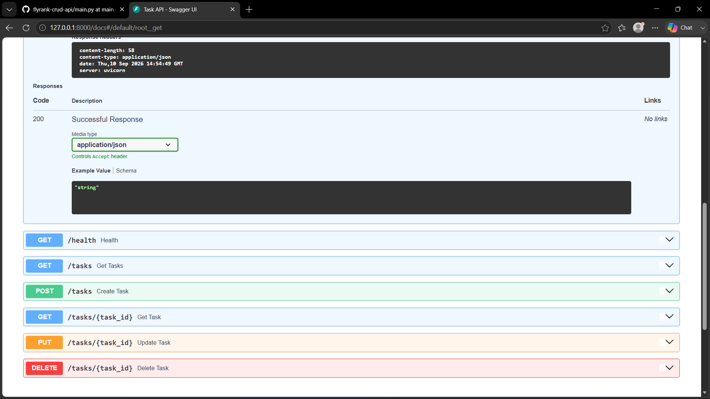

# Task API

A simple CRUD API built using Python and FastAPI.

## How to Run

Create and activate virtual environment:

```bash
python -m venv venv
venv\Scripts\activate

## Swagger UI

The API can be tested using FastAPI Swagger UI.

